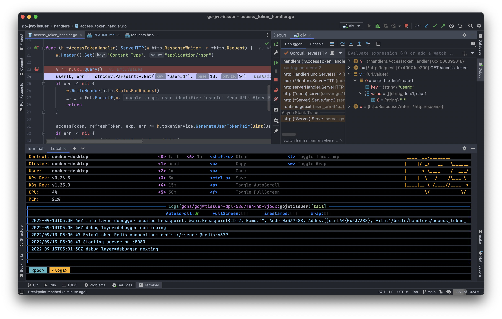

# go-jwt-issuer

### Microservice generates the pair of JSON web tokens - access-token and refresh-token are signed by user identifier.

📌 Run tests without cache:
```
go clean -testcache && go test ./*/
```

⚠️ Create namespace before deploy on Kubernetes cluster:
```
kubectl create ns gons
```


