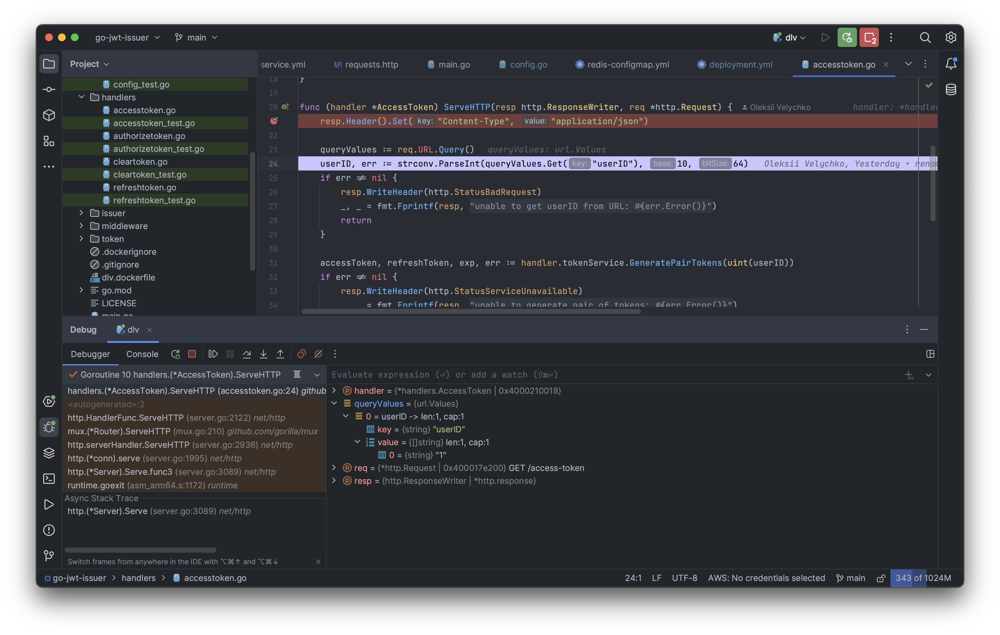

# go-jwt-issuer

### Microservice generates the pair of JSON web tokens - access-token and refresh-token are signed by user identifier.

📌 In order to deploy on Kubernetes cluster:
```
make docker-build
make kube-ns
make redis-secret password=secret
make kube-apply
```

📌 Run `k9s -n gons` to see **gojwtissuer-dpl-*** pod logs.

📌 Run/debug **dlv** configuration from IDE.

```
│ API server listening at: :56268                                                                                                                                     │
│ 2023-04-09T12:20:31Z warning layer=rpc Listening for remote connections (connections are not authenticated nor encrypted)                                           │
│ 2023-04-09T12:20:31Z info layer=debugger launching process with args: [/app]                                                                                        │
│ 2023-04-09T12:22:18Z debug layer=debugger continuing                                                                                                                │
│ 2023/04/09 12:22:18 established connection: Redis<redis:6379 db:0>                                                                                                  │
│ 2023/04/09 12:22:18 starting server on :8080 
```

📌 Add breakpoint.

```
│ 2023-04-09T12:23:29Z debug layer=debugger halting                                                                                                                   │
│ 2023-04-09T12:23:29Z info layer=debugger created breakpoint: &api.Breakpoint{ID:1, Name:"", Addr:0x3536d0, Addrs:[]uint64{0x3536d0}, AddrPid:[]int{13}, File:"/buil │
│ 2023-04-09T12:23:29Z debug layer=debugger continuing  
```

📌 Execute request.

```
│ 2023-04-09T12:24:39Z debug layer=debugger nexting                                                                                                                   │
│ 2023-04-09T12:24:39Z debug layer=debugger nexting                                                                                                                   │
│ 2023-04-09T12:25:06Z debug layer=debugger continuing                                                                                                                │
│ 2023-04-09T12:25:08Z debug layer=debugger halting                                                                                                                   │
│ 2023-04-09T12:25:08Z info layer=debugger cleared breakpoint: &api.Breakpoint{ID:1, Name:"", Addr:0x3536d0, Addrs:[]uint64{0x3536d0}, AddrPid:[]int{13}, File:"/buil │
│ 2023-04-09T12:25:08Z debug layer=debugger continuing
```

📌 Delete resources `make kube-delete`.


